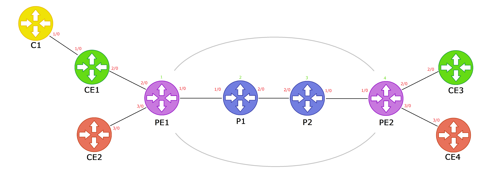

# MPLS VPN configuration generator
Authors : Cafer DINGIL, Arthur-Mustapha FARWATI, Thomas FEUTREN, Baptiste GOUYEN, Margaux MASSOL

## About
...

## Features
- 2 clients communication : CE1 with CE3 and CE2 with CE4
- CE1 has an AS C1

## Execution
`python3 conf.py <intentFile> <outputDir>`

Example : 
`python3 conf.py intent.json ./output`

## Quick deployment in a GNS project
`python3 deploy.py <confFilesDir> <projectName>`

Example : 
`python3 deploy.py output my-gns-project`

## Rules
Rules for the intent file :
 - `lp-prefix` must have 24 bits (3 blocks of 8 bits)
 - For each autonomous system `ip-prefix` must have 24 bits (3 blocks of 8 bits)

